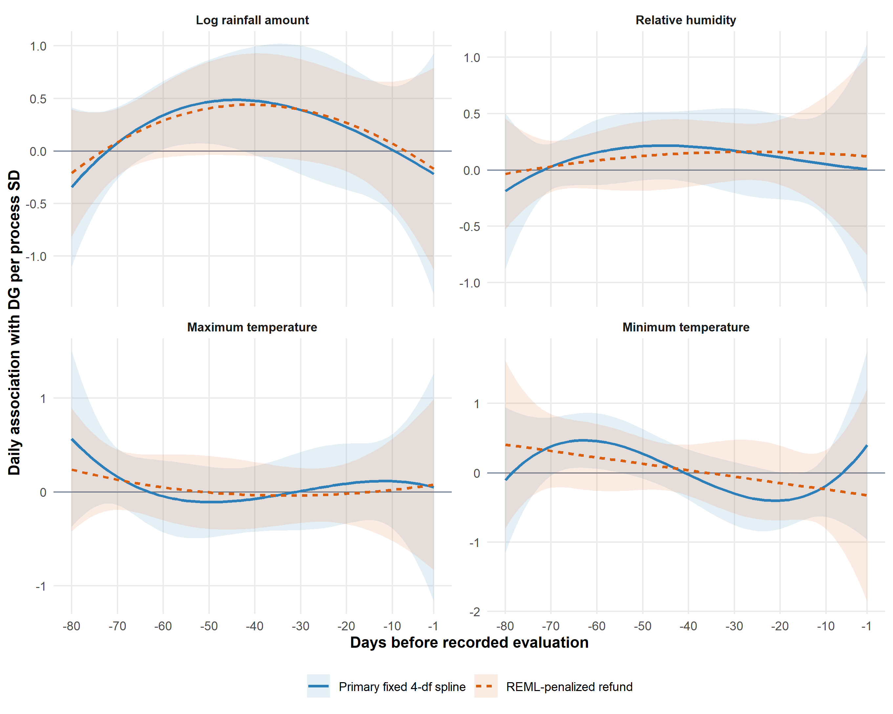
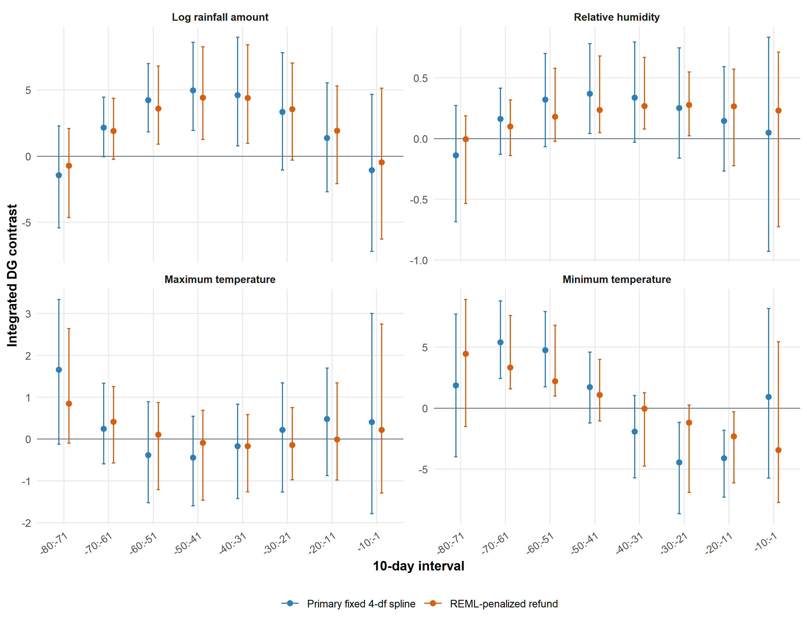
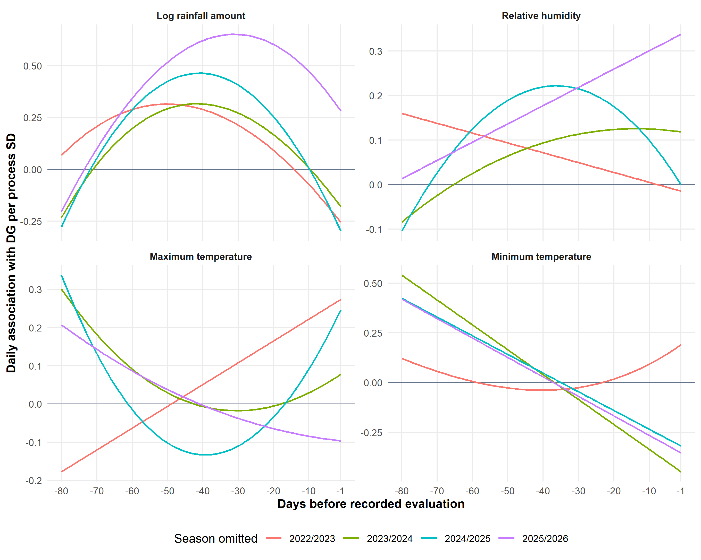

## Objective

This report evaluates which temporal weather associations from the fixed four-degree-of-freedom primary model persist when the coefficient function is regularized using REML. The penalized model is a sensitivity analysis with a different smoothness assumption, not a software-equivalence check.

## Penalized specification

Both models used the same 72 trials, weather processes, -80:-1-day domain, lag-specific centering, Gaussian damaged-grain response, season fixed effects, and ERA5 cell-by-season cluster bootstrap. The penalized model used `refund::lf()` within `refund::pfr()`, a cubic P-spline with maximum basis dimension `k = 4`, a second-order difference penalty, Riemann integration, and REML smoothing selection. Effective degrees of freedom could therefore be lower than four.

Uncertainty was estimated using 999 season-stratified ERA5 cell-by-season cluster-bootstrap samples. Daily curves use 95% simultaneous bands based on the maximum standardized bootstrap deviation. Integrated 10-day contrasts use percentile bootstrap intervals.

## Which associations survived penalization?

| Process | Primary P | Penalized P | Primary incremental R2 | Penalized incremental R2 | Penalized EDF | Curve correlation | Classification |
| --- | --- | --- | --- | --- | --- | --- | --- |
| Log rainfall amount | 0.024 | 0.020 | 0.153 | 0.149 | 2.950 | 0.991 | Survives |
| Relative humidity | 0.118 | 0.084 | 0.103 | 0.092 | 2.348 | 0.690 | Suggestive, not robust process-level evidence |
| Maximum temperature | 0.412 | 0.542 | 0.057 | 0.040 | 2.508 | 0.794 | Unsupported in both |
| Minimum temperature | 0.025 | 0.058 | 0.151 | 0.079 | 2.000 | 0.618 | Partially survives; curvature and global support attenuate |

**Log rainfall amount clearly survived penalization.** Its curve was nearly unchanged (correlation 0.991), process-level evidence remained similar (primary P = 0.024; penalized P = 0.020), and incremental R2 changed little (0.153 to 0.149). Positive integrated contrasts remained supported during -60:-51, -50:-41, and -40:-31 days.

**Minimum temperature survived only partially.** The broad early-positive/later-negative direction remained, with positive contrasts during -70:-61 and -60:-51 days and a negative contrast during -20:-11 days. However, REML reduced the curve to approximately 2.00 effective degrees of freedom, process-level P changed from 0.025 to 0.058, incremental R2 decreased from 0.151 to 0.079, and leave-one-season-out P values ranged from 0.006 to 0.703. The detailed Tmin reversal is therefore curvature- and season-sensitive.

**Relative humidity remained suggestive rather than robust.** The penalized process-level P value was 0.084 and positive integrated contrasts occurred from -50:-21 days, but the primary process-level test was also weak and the leave-one-season-out result varied substantially. Penalization did not establish a stable RH association.

**Maximum temperature remained unsupported.** Its penalized process-level P value was 0.542, no integrated interval excluded zero, and all leave-one-season-out tests remained weak.

## Process-level and curve comparison

{fig-alt="Primary and REML-penalized coefficient curves with simultaneous bands."}

**Figure 1.** Daily coefficient functions from the primary and REML-penalized models. Curves are scaled per one overall standard deviation of each process. Shading represents 95% simultaneous ERA5 cell-by-season cluster-bootstrap bands.

The penalized simultaneous daily bands included zero throughout the complete domain for all four processes. This stringent whole-curve result does not contradict supported integrated contrasts: an interval contrast estimates the cumulative association across ten adjacent days rather than requiring an individual daily coefficient to exclude zero simultaneously.

## Integrated 10-day contrasts

| Process | Primary intervals excluding zero | Penalized intervals excluding zero |
| --- | --- | --- |
| Log rainfall amount | -60:-51, -50:-41, -40:-31 | -60:-51, -50:-41, -40:-31 |
| Relative humidity | -50:-41 | -50:-41, -40:-31, -30:-21 |
| Maximum temperature | None | None |
| Minimum temperature | -70:-61, -60:-51, -30:-21, -20:-11 | -70:-61, -60:-51, -20:-11 |

{fig-alt="Primary and REML-penalized integrated interval contrasts."}

**Figure 2.** Integrated coefficient contrasts for the eight prespecified 10-day intervals. Error bars are percentile ERA5 cell-by-season cluster-bootstrap intervals.

## Leave-one-season-out stability

| Process | Penalized LOSO P range | Penalized LOSO EDF range |
| --- | --- | --- |
| Log rainfall amount | 0.004 to 0.227 | 2.72 to 2.94 |
| Relative humidity | 0.012 to 0.377 | 2.00 to 2.60 |
| Maximum temperature | 0.322 to 0.510 | 2.00 to 2.74 |
| Minimum temperature | 0.006 to 0.703 | 2.00 to 2.31 |

{fig-alt="Leave-one-season-out REML-penalized coefficient functions."}

**Figure 3.** Penalized coefficient functions after omitting each season. These are internal stability stress tests, not external validation.

## Overall conclusion

The broad log-rainfall association is robust to REML penalization and is the clearest surviving temporal process. The Tmin pattern retains its general temporal reversal but loses conventional process-level support and remains highly season-dependent, so it should be treated as a secondary hypothesis. RH remains suggestive and unstable, while Tmax remains unsupported. Penalization therefore strengthens the hierarchy of evidence rather than producing a wholly different substantive conclusion.

Analysis performed using R **4.5.0** and `refund` **0.1.40**.

